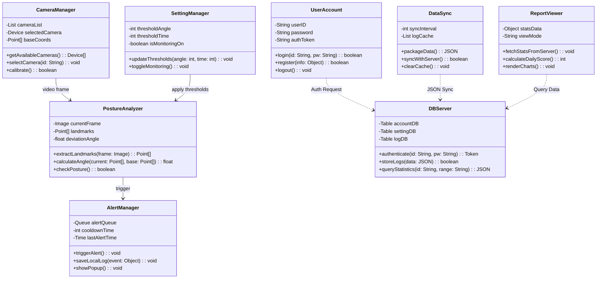
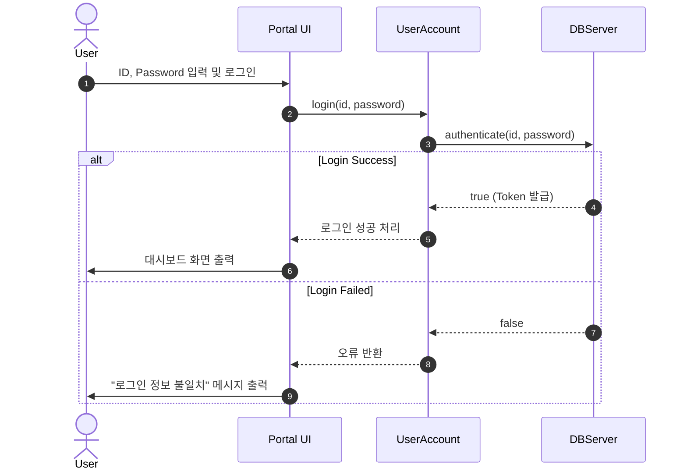
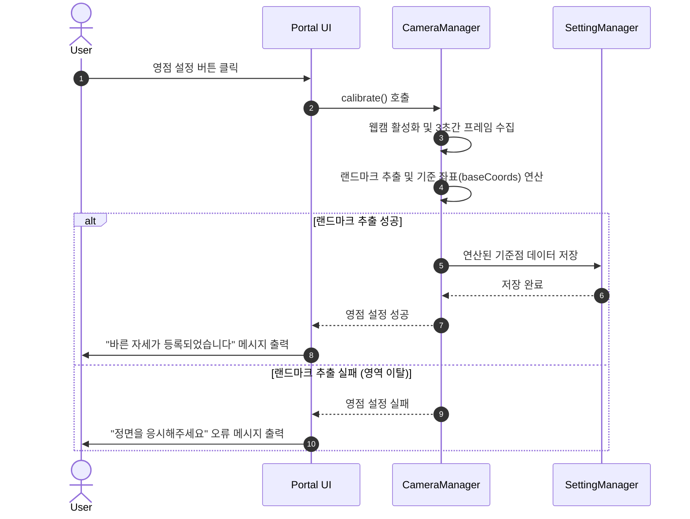
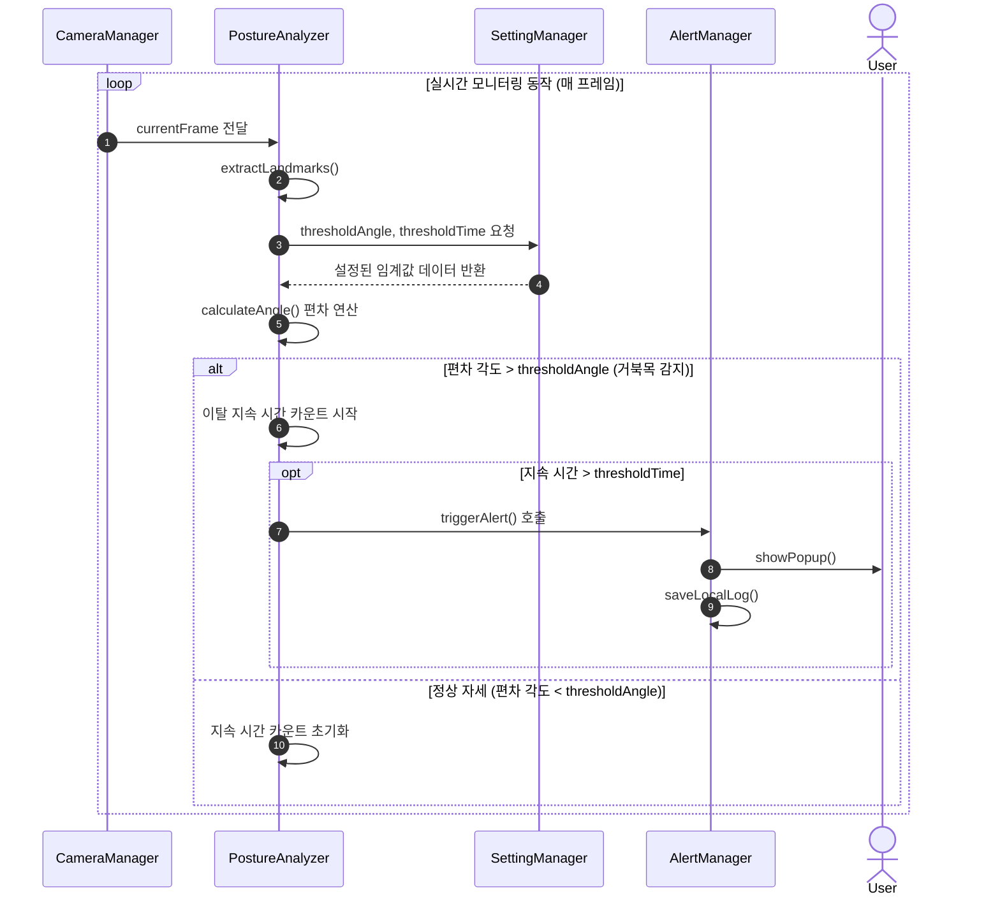
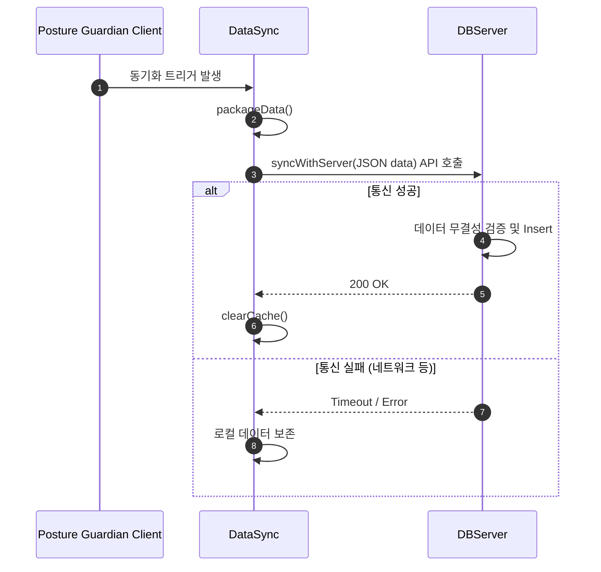

# Posture Guardian - Design Document
**웹캠을 활용한 실시간 거북목 감지 및 자세 교정 시스템**

  <strong>Student No:</strong> 22313532 
  <strong>Name:</strong> 전동규 
  <strong>E-Mail:</strong> wjsehd134613@gmail.com 
  <strong>GitHub repository:</strong> https://github.com/wjsehd/Posture-Guardian-Project

 

### [ Revision history ]

| Revision date | Version # | Description | Author |
| :--- | :--- | :--- | :--- |
| 2026/05/10 | 3.0.0 | 설계 단계(Design) 문서 작성 (Class, Sequence 다이어그램) | 전동규 |

 

## = Contents =
1. Introduction
2. Class Diagram
3. Sequence Diagram
4. State Machine Diagram
5. Implementation Requirements
6. Glossary
7. References

## 1. Introduction

현대 사회에서 사람들은 업무, 학습, 여가 등 다양한 목적을 위해 PC 앞에서 많은 시간을 보낸다. 몰입해서 작업을 하다 보면 효율성과 생산성이 높아져 서로에게 많은 도움이 된다. 그러나 현대에 와서 PC 사용 시간이 급격히 길어지면서 신체적 한계를 겪는 사람들이 생겨나기 시작했다. 조사 결과를 보면 대다수의 학생과 직장인들이 PC 사용 중 자신도 모르게 목이 앞으로 빠지는 거북목 자세를 취하게 된다고 답했다. 이렇듯 장시간 PC 사용은 필수불가결하지만, 잘못된 자세가 누적되면서 만성적인 목과 어깨 통증(VDT 증후군) 등 일어나지 말아야 할 건강 문제들이 일어난다. 

기존의 자세 교정 밴드나 고가의 의자는 비용적 부담이 크고, 단순 알람 앱은 실제 자세와 동기화되지 않는다. 그래서 이러한 한계를 극복하고 사용자들이 작업 몰입도를 유지하면서도 효율적으로 바른 자세를 관리하도록 도와주고 싶었다. 그리하여 별도의 하드웨어 추가 없이 웹캠(Webcam)을 활용하는 지능형 실시간 자세 교정 프로그램 “Posture Guardian”을 개발하게 되었다.

이 프로그램을 만들어서 이루고자 하는 첫 번째 목표는 바로 방해 없는 실시간 자세 교정이다. 고도의 집중이 필요한 작업 중에 무분별한 알람을 보내면 흐름이 끊기기 쉽다. 그래서 컴퓨터 비전의 포즈 추정(Pose Estimation) 기술을 이용해 사용자의 자세를 연산하고, 불안정한 자세가 특정 시간 이상 고착화되는 순간에만 비침투적(Non-intrusive)인 팝업을 띄워 효율적으로 PC 사용 습관을 관리할 수 있도록 할 것이다.

그 다음으론 데이터 기반의 장기적인 자세 관리이다. 단순히 그때그때 알림만 주면 나중엔 자신의 자세가 얼마나 개선되었는지 알 수가 없어진다. 그래서 서버에 경고 발생 이력(메타데이터)을 안전하게 저장하고 관리하게 하여, 시각화된 주간/월간 통계 리포트를 통해 사용자의 자발적인 교정 동기를 부여하는 게 두 번째 목표이다.

장시간 모니터 앞에서 코딩을 하는 개발자나 문서 작업을 하는 사무직, 그리고 비대면 강의를 수강하는 대학생이 주 타겟이 될 것이다. 그러나 꼭 거북목 증후군 환자가 아니더라도, 값비싼 장비 없이 소프트웨어 설치만으로 일상 속에서 바른 자세를 예방할 수 있기 때문에 모든 일반 PC 사용자들도 타겟이 될 것이다.

아래는 Analysis에 이은 이 System 개발의 세 번째 단계인 Design에 관한 내용으로써, 실제 System 구현에 직접적으로 관여하는 모든 요소들의 윤곽을 확정하고 구체적으로 디자인 해 나가는 내용을 다루고 있다. 본 문서의 모든 세부 사항은 직접적인 구현 시 소스코드상에서의 용례와 완벽히 일치함을 목적으로 한다.

 

## 2. Class Diagram

아래의 그림은 Analysis 단계에서 도출된 Domain Class들을 바탕으로, 실제 소프트웨어 구현에 필요한 속성과 메서드를 포함하여 작성한 Class Diagram이다.

### 2.1. Class Diagram

### 2.2. Detailed Class Specification

아래의 표는 Class Diagram에서 표현한 각 Class들의 구체적인 역할과 내부에 포함된 주요 속성(Attributes), 메서드(Methods)에 대한 상세 설명이다.

| Class Name | Description (클래스 설명 및 세부 항목) |
| :--- | :--- |
| **UserAccount** | 시스템을 사용하는 사용자의 계정 정보와 세션을 관리하는 클래스이다.  - `userID`, `password` : 로그인을 위해 사용자가 입력하는 아이디와 비밀번호를 저장하는 변수이다. - `authToken` : 로그인 성공 시 DB 서버로부터 발급받아 시스템 통신 및 세션 유지에 사용하는 고유 식별자 변수이다. - `login(id, pw)` : 아이디와 비밀번호를 입력받아 서버에 인증을 요청하고 성공 여부를 boolean으로 반환하는 메소드이다. - `register(info)` : 새로운 회원을 등록할 때 사용자 정보를 서버로 전송하는 메소드이다. |
| **CameraManager** | 다수의 카메라 중 자세 분석에 사용할 비디오 입력 장치를 제어하고 영점을 설정하는 기능을 가진 클래스이다.  - `cameraList` : 현재 PC에 연결된 사용 가능한 비디오 입력 장치의 목록을 저장하는 배열 변수이다. - `baseCoords` : 사용자가 바른 자세를 취했을 때 추출된 눈, 귀, 어깨의 기준 좌표(영점)가 저장되는 변수이다. - `getAvailableCameras()` : OS로부터 카메라 장치 목록을 불러와 UI의 드롭다운에 제공하는 메소드이다. - `calibrate()` : 영점 설정 기능을 실행하여 3초간 프레임을 수집하고 기준 좌표의 평균값을 연산하여 등록하는 메소드이다. |
| **SettingManager** | 사용자의 프라이버시 보호 기능과 경고 알림의 민감도(임계값)를 저장하고 관리하는 클래스이다.  - `thresholdAngle` : 거북목으로 판정할 목의 최소 기울기 이탈 각도(예: 15도)를 저장하는 변수이다. - `thresholdTime` : 불량 자세가 얼마나 지속되었을 때 알림을 띄울지 허용 시간(예: 3초)을 저장하는 변수이다. - `isMonitoringOn` : 현재 백그라운드 영상 분석 기능이 켜져 있는지 꺼져 있는지를 boolean으로 저장하는 변수이다. - `updateThresholds(angle, time)` : UI의 슬라이더를 통해 변경된 임계값 설정을 시스템에 즉시 반영하는 메소드이다. |
| **PostureAnalyzer** | 시스템의 핵심 비즈니스 로직(AI 비전 모델)을 담당하여 자세 불량 여부를 지속적으로 연산하는 클래스이다.  - `currentFrame` : 웹캠으로부터 실시간으로 입력받고 있는 현재의 영상 프레임 데이터 변수이다. - `deviationAngle` : 영점 기준 좌표와 현재 추출된 좌표 간의 기하학적 각도 편차 연산 결과를 저장하는 변수이다. - `extractLandmarks(frame)` : AI 모델(MediaPipe)을 통해 입력된 영상에서 관절 포인트(랜드마크)를 추출해 내는 핵심 메소드이다. - `calculateAngle()` : 추출된 현재 좌표와 `baseCoords`를 비교하여 기울기 각도를 도출하는 메소드이다. |
| **AlertManager** | 연산 결과 자세 불량이 감지되어 설정된 임계값을 초과할 때, 화면에 경고 팝업을 발생시키는 클래스이다.  - `cooldownTime` : 알림이 무분별하게 폭주하는 것을 막기 위해 설정된 쿨타임(대기 시간) 변수이다. - `triggerAlert()` : 자세 이탈 지속 시간이 `thresholdTime`을 초과했을 때 알림 이벤트를 촉발하는 메소드이다. - `showPopup()` : OS의 API를 호출하여 화면 우측 하단에 비침투적 경고 팝업을 실제로 출력하는 메소드이다. - `saveLocalLog(event)` : 알림이 발생한 시각과 최대 편차 각도 등을 메타데이터로 만들어 로컬 스토리지에 저장하는 메소드이다. |
| **DataSync** | 로컬에 임시 저장된 경고 로그 데이터들을 모아 원격 DB 서버로 전송하고 동기화하는 기능을 담당하는 클래스이다.  - `syncInterval` : 백그라운드에서 서버와 데이터를 동기화할 주기(예: 1시간)를 지정하는 변수이다. - `logCache` : 서버로 전송되기 전까지 임시로 알림 로그들을 담아두는 리스트 변수이다. - `packageData()` : 로컬에 쌓인 미전송 로그들을 통신 규격에 맞게 JSON 형태로 패키징하는 메소드이다. - `syncWithServer()` : 주기 도달 또는 프로그램 종료 시 DB 서버의 API를 호출하여 데이터를 전송하는 메소드이다. |
| **ReportViewer** | 서버로부터 누적 통계 데이터를 받아와 대시보드 형태의 시각적 그래프로 화면에 출력하는 클래스이다.  - `statsData` : 서버로부터 응답받은 주간/월간 통계 JSON 데이터를 파싱하여 들고 있는 객체 변수이다. - `fetchStatsFromServer()` : 현재 사용자의 누적 통계 데이터를 DB 서버에 쿼리(요청)하여 가져오는 메소드이다. - `calculateDailyScore()` : 수신된 경고 빈도와 모니터링 유지 시간 등을 수식으로 계산하여 일일 건강 점수를 산출하는 메소드이다. |
| **DBServer** | 클라이언트 프로그램 외부에서 회원 정보, 설정, 누적 통계 로그를 안전하게 보관하는 시스템 외부 클래스(서버)이다.  - `accountDB`, `logDB` : 사용자 계정 정보와 각 사용자가 발생시킨 알림 로그들이 실제로 저장되는 데이터베이스 테이블이다. - `authenticate(id, pw)` : 클라이언트로부터 로그인 요청이 오면 DB를 대조하여 검증하고 토큰을 발급하는 메소드이다. - `storeLogs(data)` : `DataSync` 클래스로부터 전송받은 JSON 로그들의 무결성을 검증하고 테이블에 안전하게 Insert 하는 메소드이다. |

## 3. Sequence Diagram

아래에 나오는 그림들은 Analysis 단계에서 정의된 주요 유스케이스들의 동적 모델링을 위해, 객체 간의 상호작용과 메시지 호출 순서를 구체화한 Sequence Diagram이다.

### 3.1. 계정 인증 및 로그인 (Login)

위의 그림은 사용자가 시스템에 접속하기 위해 계정 인증을 수행하는 과정을 나타낸 Sequence Diagram이다. 
로그인 UI에서 사용자가 아이디와 패스워드를 입력하면 `UserAccount` 객체가 `DBServer`의 API를 호출하여 인증을 요청한다. 서버의 반환 결과(true/false)에 따라 유효한 AuthToken을 발급받아 메인 대시보드로 진입하거나, 로그인 정보 불일치 에러 메시지를 출력하여 사용자의 접근을 제어한다.

### 3.2. 영점 설정 (Camera Calibration)

이 다이어그램은 시스템이 정확한 자세 판별을 수행하기 위해, 사용자의 고유한 신체 조건과 카메라 앵글에 맞춘 바른 자세(영점)를 최초로 측정하고 기준점으로 등록하는 과정을 보여준다.
사용자가 영점 설정 버튼을 누르면 CameraManager가 3초간 비디오 프레임을 수집하여 랜드마크를 추출한다. 정상적으로 얼굴과 어깨가 인식되어 기준 좌표 연산에 성공하면 그 데이터를 SettingManager를 통해 시스템에 업데이트하고, 앵글을 벗어났을 경우 실패 메시지를 통해 재시도를 유도한다.

### 3.3. 실시간 자세 분석 및 경고 알림 (Analyze Posture & Send Alert)

이 다이어그램은 본 시스템의 가장 핵심적인 비즈니스 로직인 실시간 거북목 모니터링과 비침투적 피드백 제공의 내부 흐름을 나타낸다.
백그라운드에서 매 프레임마다 PostureAnalyzer가 작동하여 현재 자세의 편차를 연산한다. 사용자가 설정한 이탈 각도(thresholdAngle)를 초과한 나쁜 자세가 감지되면 지속 시간 타이머가 작동하며, 이 상태가 허용 시간(thresholdTime)을 초과할 때만 AlertManager가 경고 팝업을 발생시키고 로컬 데이터베이스에 로그를 기록한다. 사용자가 정자세로 돌아오면 타이머는 즉시 초기화된다.

### 3.4. 데이터 동기화 (Sync Data)

오프라인 환경에서도 끊김 없이 작동해야 하는 시스템의 특성을 고려하여, 로컬에 임시로 쌓여있는 알림 로그들을 원격 서버에 주기적으로 백업하는 과정을 나타낸 다이어그램이다.
1시간 등 특정 주기가 도래하거나 프로그램이 종료될 때, DataSync 객체가 로컬 데이터를 JSON 형식으로 패키징하여 DBServer로 전송한다. 통신에 성공하면 무결성을 위해 임시 캐시를 비우고, 네트워크 단절 등으로 통신에 실패할 경우 데이터를 지우지 않고 보존하여 다음 주기에 재시도하는 안전한 구조를 가진다.

